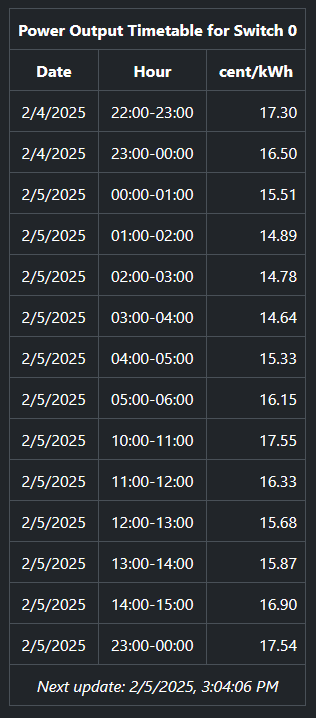

# Spot-Price Based Control of Shelly Devices

## Introduction

This script uses EPEX spot energy prices to control the power output of a Shelly device. It runs
directly on the Shelly and the only technical requirement is that the Shelly has access to the
internet. The script should run on all Gen2+ Shelly switches.

The goal of the script is to activate power output when prices are at their lowest during a
predefined daily time window. You can use configuration variables to define the time window and the
number of hours for which power output should be active. Example:

You set the time window so that it starts at 7:00 and ends at 19:00; in addition, you define that
power output should be active for 4 hours within this window.

With the above settings, the behavior of the script depends on which mode you choose:

In block mode, the script will identify the 4-hour block with the lowest average price between 7:00
and 19:00 and activate power output for this block.

In non-block mode, the script will activate power output for the 4 cheapest hours between 7:00 and
19:00 - independent of whether they are consecutive or not.

The calculated results can be reviewed and modified on the Web UI that is provided by the script:

<p align="center">
  
</p>

There are some additional features:

- The script can either work with hourly or 15-minute prices. Choose the mode that matches the
  contract that you have with your supplier.
- If price data can not be downloaded due to technical issues, the script provides an optional
  fallback mode to ensure that power is provided for the configured number of hours.
- You can define a hard price limit (e.g. 10 cent/kWh) that must not be exceeded. If the price
  of any of the cheapest hours exceeds this limit, power output will not be activated for this hour.
- You can define a custom formula to convert the EPEX spot price to the price that is charged to
  you by your electricity provider.
- Telegram integration: Optionally, the script can send you Telegram messages whenever the timetable
  has been updated and when power has been switched on or off by this script.
- For multi-switch devices like the Shelly 2PM or 3PM, you can define which of the switches should
  be controlled by the script.

Note:
The prices are provided by [energy-charts.info](https://energy-charts.info), an organization that
generously offers unrestricted access to their EPEX market price API. The license under which
price data is made available depends on your location - see
[the API documentation](https://api.energy-charts.info/#/prices) for details.

## Installation

Before you start the installation process, make sure that the firmware version on your Shelly is at
least 1.5.0. Then, follow these steps:

1. Enter the IP Address of your Shelly in the URL field of your browser.
1. Select the `Scripts` Tab.
1. Click on the `Create Script` button.
1. Copy the COMPLETE source code from [this link](./dist/final.js) into the script window.
1. (Optional): Enter a script name in the corresponding field.
1. Change the configuration variables in the script to your preference (see next section for
   details).
1. Click the `Save` and `Start`. The script is now running.
1. Go back to the `Scripts` tab and make sure that the text below the script name says
   `Running`.<br>(Also take note of the Script number that the Shelly has automatically
   assigned to the script. You will use this number later to review information in your browser.)
1. Activate the `Run on startup` switch to make sure that the script restarts after a
   reboot of the device.

## First Start

Once you have started the script, you can always look at the Web UI to see the current status. The
Web UI can be opened in the browser with the URL `http://<ipAddress>/script/<scriptNumber>/spotelly`
(you can find the script number on the `Scripts` tab of the WebUI as mentioned in step 8 above).

If you have started the script before 15:00, the script schedules the first calculation for shortly
after 15:00. If the first start occurs after 15:00, the script starts the first calculation
immediately.

It is always possible that a calculation fails because the price data for the next day is not yet
available from the API. In that case, the script automatically schedules another attempt 20 minutes
later. You can always see the time of the next planned update in the Web UI.

## Configuration

The behavior of the script can be customized by changing the following variables to your needs:

### epexBZN (default `AT`)

This defines the code of the EPEX bidding zone that is used as source for the prices. A list
of the available zones can be found in the
[the energy-charts API documentation](https://api.energy-charts.info/)
(expand the "Available bidding zones" dropdown).

The code of the bidding zone must be entered exactly as shown (capitalization is important!).

### hourMode (default `true`)

This variable defines if the script should work with hourly or 15-minute prices.

When set to `true` (the default), the script calculates and displays switch times for full hours
only (based on the average price for each hour).

When set to `false`, switch times are calculated and displayed based on quarter hours. All script
features like time windows, block mode and price limits work as expected and the WebUI timetable
allows manual modifications for each quarter hour. There is, however, one difference in the setup
of the script:

In 15-minute mode, the `switchOnDuration` variable defines the duration in quarter hours, not in
hours. So, if you want to set a total duration of e. g. five hours, the correct value for this
variable would be `20`.

### blockMode (default `true`)

This sets the basic operating mode of the script. Two modes are supported:

If `blockMode` is set to `true`, the script switches on power for the block of `switchOnDuration`
consecutive (quarter) hours with the lowest average price within the defined time window.

If `blockMode` is set to `false`, the script switches on power for the cheapest `switchOnDuration`
(quarter) hours within the time window, even if they do not form a contiguous block.

### switchOnDuration (default `4`)

The script switches on power for the number of (quarter) hours that is defined in this variable.
Depending on the setting of the `blockMode` variable (see below), power is either activated in one
contiguous block or spread out over the time window (depending on the prices).

The switchOnDuration must be a whole number in the range of 1 to 24 (in hourly mode) or 1 to 96 (in
15-minute mode).

### timeWindowStartHour & timeWindowEndHour (default `7` & `19`)

These two variables define the time window within which the cheapest (quarter) hours are found.
The default time window is 7:00 to 19:00.<br><br>
Both values must be whole numbers in the range of 0 to 23. If you want the time window to match the
calendar day, set both values to zero.<br><br>
The `timeWindowEndHour`must be greater than the `timeWindowStartHour` or `0` if you want to end
the time window exactly at 0:00.

### priceLimit (default `Infinity`)

This variable defines a price limit which is expressed in cent per kWh. Power is not switched
on for (quarter) hours with prices that are higher than this limit.

The price limit can have decimals - e.g. a value of 10.5 cent is perfectly fine. The default value
of `Infinity` means that there is no price limit.

### useFallback (default `true`)

The script requests the prices for the next day from the API every day shortly after 15:00. If the
price retrieval fails (either because the prices for the next day are not yet available or
due to connection or server issues), the script automatically retries the request in intervals
of 20 minutes until it has completed successfully.

If all retrieval attempts fail until approximately 15 minutes before midnight, the script stops
the retrieval process and the `useFallback` setting determines what happens next:

If `useFallback` is `true`, the script uses statistical prices to calculate the active (quarter)
hours for the next day. These prices are the average prices of the Austrian and German market for
the year 2024.

If `useFallback` is `false`, no calculation takes place for the day in question.

### `priceModifier`

By default, the script calculates with and displays EPEX spot prices. There are, however, many
other components on your invoice that are added to this price like fees and taxes. And some of these
components may be variable, for example grid fees that vary by time of day or time of year.

By changing the `priceModifier` function, you can write your own logic that adds your individual
components to the EPEX price and this modified price is then used by the script to determine the
cheapest hours. An example:

A grid operator charges different grid fees depending on the time of day:

- The fee is 10 ct/kWh during the peak hours from 7:00 to 9:00 and 18:00 to 20:00.
- For the remainder of the day, the fee is 8 ct/kWh.

The `priceModifier` function can be modified like so to add these fees to the EPEX price:

```javascript
function priceModifier(datetime, spotPrice) {
  let hour = datetime.getHours(); // extract hour from the datetime
  if (hour === 7 || hour === 8 || hour === 18 || hour === 19) {
    return spotPrice + 10; // peak hour - add 10 cent to the EPEX price
  }
  return spotPrice + 8; // normal hour - add 8 cent to the EPEX price
}
```

These modified prices are then used by the price analysis algorithm to determine the cheapest
hours of the day.

The algorithm can be as complex as you need it to be - just make sure that the expression after the
`return` statement(s) always returns a number. The resulting value will be rounded to two decimal
positions when it is displayed on the Web UI.

Note: Even if you do not use this feature, do NOT remove this function - the script will not work
if it is missing!

### switchID (default `0`)

This setting sets the switch ID for Shelly devices with multiple switches (like the 2PM or 3PM). On
a device with only one switch, the ID is always `0`. Each instance of the script can only control
a single switch.

### invertSwitch (default `false`)

This setting can invert the switching logic which is useful for some electrical configurations:

When set to `false`, the script turns the switch ON for the selected (cheapest) hours and OFF for
the remaining hours.<br>
When set to `true`, the script turns the switch OFF for the selected (cheapest) hours and ON for
the remaining hours.

### telegramActive (default `false`)

Set this to `true` to activate the Telegram feature. In order to use this feature, you need to have
Telegram installed. You also need a Telegram token and a Telegram ChatID. A description on how to
obtain both can be found here:
<a href="https://gist.github.com/nafiesl/4ad622f344cd1dc3bb1ecbe468ff9f8a" target="_blank"> How to
get Telegram Bot Chat ID</a>.

The following variables are only used when telegramActive is `true`:

#### telegramToken & telegramChatID (default `""` and `""`)

Both variables MUST be filled when telegramActive is true - otherwise, the feature will not work.

#### deviceName (default `Shelly`)

The value of this variable is included in the Telegram message in order to identify the sender.
Especially useful when you run the script on several Shellies and want to know which one sent which
message.

#### sendSchedule (default `true`)

If true, the script sends a Telegram message whenever a calculation run has finished successfully.

#### sendPowerOn (default `true`)

If true, the script sends a Telegram message when power output is switched on by the script.

#### sendPowerOff (default `true`)

If true, the script sends a Telegram message when power output is switched off by the script.

## FAQ

### A new version of the script is available. How do I upgrade?

If there are no specific upgrade instructions in the CHANGELOG, use the following steps:

1. Note down the values of your configuration variables
2. Stop the script
3. COMPLETELY replace the code of the script with the new version
4. Reapply the values of your configuration variables from step 1
5. Start the script

### I want to modify the script and/or the HTML endpoint. How do I do that?

In order to reduce RAM usage on the Shelly, the script uses a build script that compresses the HTML
of the Web UI and merges this compressed version into the script source code. If you want to
change the script or the Web UI, you need to use this process as well.

First, make sure that you have `Node.js` installed (any recent version will do). Then, clone the
repository:

```
git clone https://github.com/towiat/spotelly
```

and install the development dependencies with npm (or the package manager of your choice):

```
npm i
```

Now, you can make your changes by repeating the following steps as often as you need:

1. Modify `./src/spotelly.js` and/or `./src/endpoint.html` as needed
2. Run `npm run build` to execute the HTML compression and merge
3. Install the merged source file `./dist/final.js` on your Shelly

See the source code in the build script `build.js` for a detailed description of the compression
and merge process.
